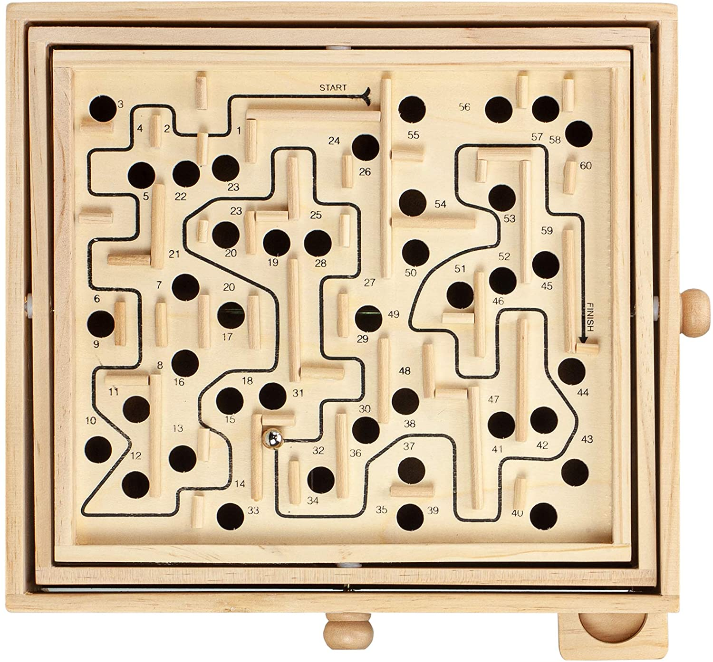

# Labyrinth
Author: Maarten Fish
### RL agent on classic labyrinth game. 
**2D grid-like vs 3D physics based environment in Unity.**

As a challenge to further explore **deep-learning** with [Ray's rllib](https://docs.ray.io/en/master/rllib.html), the nostalgic **wooden labyrinth game** came to mind. 
This seemed appropriate since at first glance it looks and feels like a basic **grid-world experiment**.
In reality however, there are certain conflicts introduced by the **ball drop mechanic**.
  - If dropping a ball terminates the episode and there is a -1 step-cost to incentives finding the exit asap,  
    the agent will find the nearest hole and terminate the episode for the least penalty.
  - By removing the step-cost (0) the agent becomes afraid to trigger the -1 penalty and terminating the episode,  
    this cause the agent to wander around it's start position in relative safety, causing an endless loop.
  - To correct this behavior we keep track of states the agent has visited during the episode.  
    A positive fraction of the step-cost is given to the agent as reward when it enters a 'fresh' state.  
    If the state was previously visited we apply the normal step-cost, to avoid a zero-sum value reward only a fraction.
  - With this 'fresh' state reward signal in place it is important to terminate the episode on ball-drop.  
    If a ball-drop just resets the position to start, the agent will have to pass previously visited states for a penalty.
    
After completing the **2D environment as a proof of concept**, [Unity's ml-agents](https://github.com/Unity-Technologies/ml-agents)
is used in cooperation with rllib. This steps up the complexity from grid-based 2D labyrinth to **physics-enabled 3D edition** which closely mimics the real labyrinth game pictured below.

    



# Trainer quick-start:
```
$ python labyrinth_train.py --curiosity
```
- Enables **rllib's Curiosity module** which promotes exploration when dealing with sparse reward
```
$ python labyrinth_train.py --restore checkpoint_2D_500.cpt
```
- **Pick up training** from passed **checkpoint**
```
$ python labyrinth_train.py --iter 500 --checkpoint 100 --workers 5 --lr 2e-5 --batch 512 4096 128 8
```
- **Train** for 500 iterations, makes a checkpoint every 100 batches
- Initialise 5 **workers** and set alpha **learning-rate** to 0.00002
- Batch refers to the **PPOTrainers** SGD related parameters
  1. **rollout_fragment_length**: Fragments generated by the workers
  2. **train_batch_size**: Fragments fill up the training batch (eg. 4000 -> 20 x 200)
  3. **sgd_minibatch_size**: Minibatches within SGD epochs
  4. **num_sgd_iter**: Number of times looping over SGD
